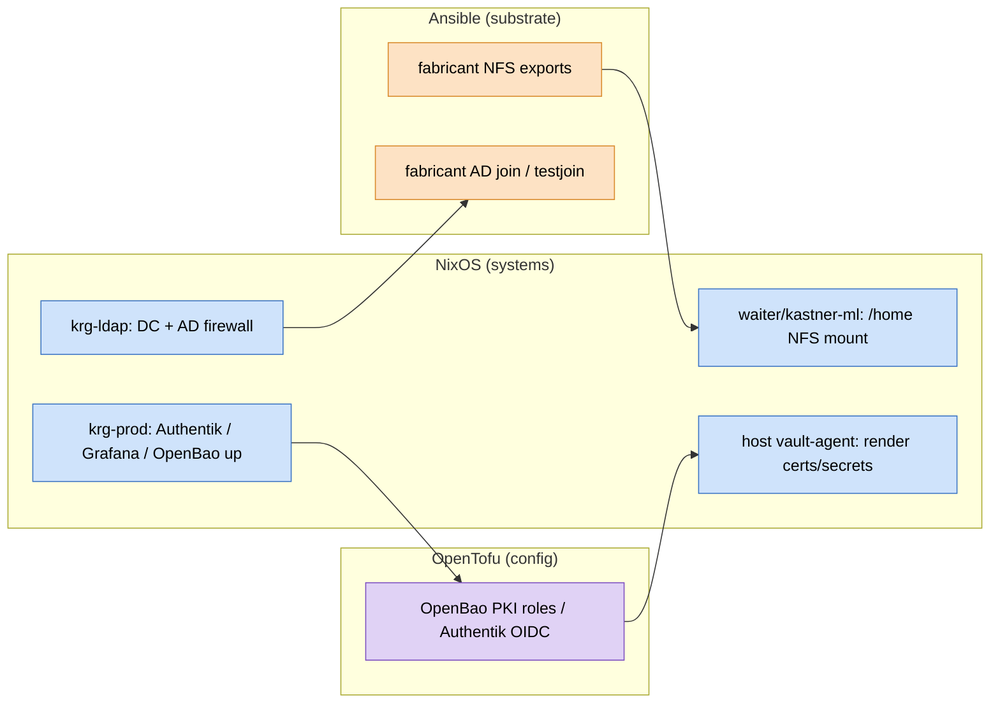

# 0011. Cross-layer deploy ordering: a phased pipeline, not a single linear order

**Status:** Accepted · **Date:** 2026-06-18

## Context

The fleet is applied by three layers — **Ansible** (Proxmox/Debian + Synology),
**NixOS** (the flake), **OpenTofu** (service config) — and `deploy.yml` runs them in
a fixed linear order: **Ansible → NixOS → OpenTofu** (see
[`lab-interdependencies.md`](../lab-interdependencies.md) and
[ADR 0005](0005-repo-integration-opentofu-krg-deploy.md)). That order was itself a
correction: NixOS used to run first, and it was flipped to Ansible-first because the
NixOS compute boxes mount `/home` from NFS exports that the Ansible layer creates.

The trouble is the layers depend on each other in **both** directions, so no single
linear order satisfies every edge:

- **Ansible → NixOS** — fabricant's NFS exports must exist before waiter/kastner-ml
  mount `/home`. *(Why we flipped to Ansible-first.)*
- **NixOS → Ansible** — krg-ldap's in-guest AD firewall (a NixOS change) must open the
  DC ports before fabricant (Ansible-managed) can join/validate AD. *(The deadlock
  that surfaced in PR #282: the Ansible `adcli testjoin` gate would fail before the
  NixOS stage applies the firewall fix.)*
- **NixOS → OpenTofu** — Authentik/Grafana/OpenBao must be up before Tofu configures
  them through their APIs.
- **OpenTofu → NixOS** — the OpenBao PKI roles / Authentik OIDC write-back must exist
  before a host's `vault-agent` can render its certs/secrets.

Pick any linear order and at least one edge points backward; flipping the order just
moves *which* edge breaks. We have now hit that twice (NFS, then AD-firewall).

**The reframe:** at the *layer* granularity this is a dependency **cycle**; at the
*resource* granularity it is a **DAG**. The cycles are an artifact of batching every
resource in a layer into one monolithic stage — `fabricant-NFS-export` and
`fabricant-AD-join` are both "Ansible," but the first is a dependency *of* NixOS and
the second depends *on* NixOS. Treating "Ansible" as one node manufactures a false
cycle. So the question is not "what order" — it is "how fine-grained, and how do we
handle the edges that remain."



Read by *resource* the graph is acyclic — every edge flows left-to-right and there
is no cycle to break. The apparent deadlock only appears when you collapse each
coloured cluster to a single node: then `Ansible → NixOS` (nfs→homemount) and
`NixOS → Ansible` (dcfw→adjoin) point in opposite directions and no layer ordering
satisfies both. The fix is therefore *not* a better layer order but a phasing that
respects the resource edges.

## Decision

Do **not** reorder the layers to chase each new dependency. Adopt a **phased
pipeline** built from four principles:

1. **Foundation first (`phase 0`).** Resources that *many* layers depend on are
   infrastructure, not "just another host": the **DC (krg-ldap) + its AD firewall**,
   **DNS**, the **firewall IPSets** (`trusted.json`), and the **OpenBao mounts / PKI
   structure**. Apply these before the main layer stages, regardless of which layer
   owns them. This alone removes both back-edges (NixOS→Ansible AD-firewall and
   OpenTofu→NixOS PKI) by hoisting the shared prerequisite to the front.

2. **Separate convergence from verification.** Health/membership **gates must not run
   mid-converge** — they belong in a **single final verify phase**, after every layer
   has applied, for all hosts at once. This eliminates the whole class of "a gate
   depends on a later stage" (e.g. the AD `adcli testjoin` gate must run *after*
   krg-ldap's firewall lands, not inside the earlier Ansible stage).

3. **Idempotent, converge-to-fixed-point as the backstop.** For any residual cycle,
   make every step idempotent and let it settle over repeated application. We already
   have this as eventual consistency — the nightly `system.autoUpgrade` (NixOS) and
   the `ansible-apply` timer re-converge independently. The push deploy is therefore
   best-effort single-pass with **non-fatal gates during converge**; correctness is
   guaranteed by the verify phase + the timers, not by one perfect ordering.

4. **Encode the edges explicitly.** `lab-interdependencies.md` already draws the
   graph; the deploy should *consume* it as an ordered phase list with each
   cross-layer edge annotated — so the next new dependency is slotted into the right
   phase instead of triggering another global reorder.

### Target phase model

```
phase 0  foundation   krg-ldap (DC + AD firewall) · OpenBao mounts/PKI · DNS · firewall IPSets
phase 1  substrate    Ansible (NFS exports, Proxmox firewall)        — idempotent, gates → warn
phase 2  systems      NixOS members (waiter, krg-prod, …)            — idempotent, gates → warn
phase 3  config       OpenTofu (authentik, grafana, temporal, …)     — idempotent, gates → warn
phase 4  verify       ALL membership/health gates, every host        — fatal here, once
```

The clean "one layer = one stage" model is kept for the bulk (phases 1–3); phase 0
pulls the few foundational nodes to the front; phase 4 is where every cross-layer
gate lives so none can deadlock.

## Consequences

- **No more reorder whack-a-mole.** New cross-layer dependencies get a phase, not a
  global flip. Gates can't deadlock the deploy that would satisfy them.
- **Cost:** phase 0 deliberately applies a few resources *out* of their layer's batch
  (e.g. rebuild krg-ldap before the Ansible stage), and there are more phases to keep
  ordered. The deploy is slightly less "three clean stages," more "a small annotated
  DAG." Worth it.
- **Implementation is a follow-up**, not this ADR: refactor `deploy.yml` +
  `deploy/*.sh` into the phase model and move the AD-membership gate to phase 4. This
  ADR records the approach so that work has an agreed target.
- **Immediate instance already applied (PR #282):** the Ansible `adcli testjoin` gate
  was deferred (`ad_require_joined` left default-false in `deploy-ansible.sh`) rather
  than run mid-Ansible — principle #2 in tactical form. When phase 4 exists, that
  gate returns there, running after krg-ldap's firewall fix, where it cannot deadlock.
- **Backstop unchanged:** the nightly pull-converge remains the safety net for any
  edge not perfectly ordered in the push path.

See [`lab-interdependencies.md`](../lab-interdependencies.md) for the live edge list,
[`deploy.yml`](../../.github/workflows/deploy.yml) for the current ordering, and
[ADR 0005](0005-repo-integration-opentofu-krg-deploy.md) for the krg-deploy control-node model.
