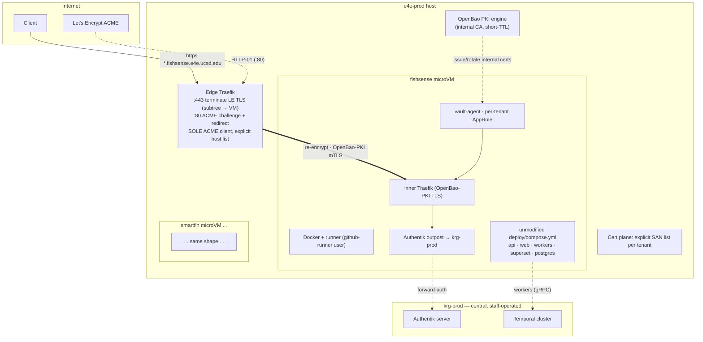

# e4e-prod tenant platform — architecture & onboarding

> **⚠️ SUPERSEDED (mechanism).** The tenant *mechanism* below (microvm.nix /
> cloud-hypervisor / `krg.tenants` / `krg.tenantPlatform`) was retired by
> [ADR 0017](adr/0017-incus-nat-self-serve-platform.md) and
> [ADR 0020](adr/0020-tenant-deploy-contract-mktenant.md): tenants are now
> **Incus instances on krg-nat**, fronted by `krg.edge`, provisioned via
> `lib.mkTenant`. For the current onboarding runbook see
> [onboarding-fishsense.md](onboarding-fishsense.md). The architecture goals
> (repo-owns-deploy, edge LE-terminate + re-encrypt over OpenBao PKI, per-tenant
> AppRole, GitHub-App runner registration) still stand; only the guest mechanism
> changed.

> Design companion to [ADR 0008](adr/0008-e4e-prod-tenant-platform.md). The ADR
> records *what* was decided and *why*; this doc is the *how* — topology, the
> `krg.tenants` interface (retired — now Incus/`lib.mkTenant`, see banner), the
> request path, secrets/PKI, and onboarding. Status: **e4e-prod is provisioned &
> deployed as the Incus edge** (`krg.edge.enable`; first install 2026-06-23). The
> historical microvm.nix/`krg.tenants` design captured below is kept for context —
> annotated, not deleted — but the live mechanism is Incus + `lib.mkTenant` per
> the banner.

## What e4e-prod is

The home for student-built **E4E** project services. Each project owns its own
repo, its own `deploy/compose.yml`, and its own deploy (a self-hosted runner
doing `docker compose up` on merge). The platform owns only the *substrate*
around each project. fishsense-lite is tenant #1; smartfin and future E4E
projects follow the same pattern.

Contrast with krg-prod: krg-prod is staff-operated lab infrastructure where
*this repo* owns every service definition. e4e-prod inverts ownership — the
tenant repo owns the app; the platform owns isolation, ingress, certs, and
secrets plumbing.

## Topology



Key: a **single** edge Traefik holds the only public LE key and is the only
ACME client. Each tenant is a sealed microVM; the edge re-encrypts to it over
internal OpenBao PKI. Authentik and Temporal are reached cross-host on krg-prod.

## Request path

Two cases matter — a sub-service and the **subtree apex** (the web portal lives
*at* `fishsense.e4e.ucsd.edu`, the apex itself):

1. Client → `https://orchestrator.fishsense.e4e.ucsd.edu` **or**
   `https://fishsense.e4e.ucsd.edu` resolves (per-hostname CNAME → e4e-prod) to
   the host edge `:443`.
2. Edge Traefik **terminates** the public LE cert (the SNI selects the fishsense
   tenant's multi-SAN cert), matches the **fishsense tenant rule — apex +
   descendants**, `HostRegexp(`^(.+\.)?fishsense\.e4e\.ucsd\.edu$`)` → fishsense
   VM, and **re-encrypts** over OpenBao-PKI (mTLS) to the VM's inner Traefik.
3. Inner Traefik terminates the internal cert and routes by `Host(...)` to the
   app container — `orchestrator.fishsense…` → the API (behind the tenant's own
   `authentik@docker` outpost, which forward-auths to krg-prod Authentik);
   `fishsense.e4e.ucsd.edu` → the `fishsense-lite-web` portal (auth is **in-app
   OIDC** to krg-prod Authentik, *not* edge/forward-auth).
4. fishsense workers reach krg-prod's Temporal over gRPC; SSO subjects resolve
   against krg-prod Authentik. Object store (Garage) + NAS are reached per the
   tenant's own mounted config, outside the platform's concern.

> **Apex is load-bearing.** `fishsense.e4e.ucsd.edu` sits under `*.e4e.ucsd.edu`,
> **not** under `*.fishsense.e4e.ucsd.edu` — a bare `*.fishsense…` wildcard would
> miss it. The tenant rule must cover the apex label *and* everything beneath it
> (`^(.+\.)?<subtree>$`), so tenants partition the shared `*.e4e.ucsd.edu` space
> cleanly: `fishsense.*` → fishsense VM, `smartfin.*` → smartfin VM, each owning
> its label apex + subtree.

## The `krg.tenants.<name>` module (interface sketch)

> (retired — now Incus/`lib.mkTenant`, see banner. The current NixOS surface is
> `nixosModules.tenant` (singular) + `lib.mkTenant`, not `krg.tenants.<name>` /
> `krg.tenantPlatform`.)

Namespace is **`krg.tenants`** (generic, org-wide), not `e4e.*` — see
[ADR 0008 §6](adr/0008-e4e-prod-tenant-platform.md). Not yet written — this is the
intended surface. Each tenant is one declaration; the module generates the
microVM, user, ZFS volume + caps, runner, vault-agent targets, OpenBao AppRole
reference, and the edge hostname→VM rule.

```nix
# shared tenant roster — imported by every platform host
krg.tenants.fishsense = {
  platform = "e4e-student";                # which platform instance hosts this
  repo = "UCSD-E4E/fishsense-lite";        # repo-scoped runner registers here
  subtree = "fishsense.e4e.ucsd.edu";      # → rule ^(.+\.)?fishsense\.e4e\.ucsd\.edu$ (apex + descendants)
  hostnames = [                            # EXPLICIT SAN list for LE issuance
    "fishsense.e4e.ucsd.edu"               # web portal
    "orchestrator.fishsense.e4e.ucsd.edu"  # API
    "analytics.fishsense.e4e.ucsd.edu"     # superset
    # NB: no workflows.* — Temporal UI is krg-prod's workflows.krg.ucsd.edu
  ];
  deployDir = "/srv/fishsense";            # persistent runner checkout (in-VM)
  resources = { vcpu = 6; memMiB = 16384; diskGiB = 200; };
  isolation = "microvm";                   # pluggable knob (default)
  secrets.openbaoPath = "secret/e4e-student/fishsense";  # per-tenant AppRole scope
};

# in the platform host (currently e4e-prod, → e4e-student if krg-student lands)
krg.tenantPlatform = { enable = true; id = "e4e-student"; };
```

Routing stays stable: adding `newthing.fishsense.e4e.ucsd.edu` needs **no** edge
routing change (the subtree rule catches it) — only a CNAME ticket and a
one-line `hostnames` addition (the SAN re-issue), plus the tenant's own
compose service.

### Multiple platforms

> (retired — the `krg.tenantPlatform` per-platform-instance framing below is
> superseded by the Incus zone / `krg.edge` model, see banner.)

The design is a **per-platform instance**, not e4e-prod-specific. A host becomes
a platform with `krg.tenantPlatform = { enable = true; id = "<id>"; }` and owns
that instance's edge Traefik + microVM fleet + cert-manager + bridge (its own IP,
LE ACME client, internal-CA client cert). A platform host instantiates only the
`krg.tenants` whose `platform` matches its `id`; the rest stay inert there. So an
`e4e-student` and a `krg-student` platform can run **concurrently**, tenants
partitioned by the `platform` field. Reassigning a tenant is a one-field change
(+ a DNS CNAME re-point + cert/zvol re-home, since each platform has its own edge
IP/cert). This is why the module is generic `krg.tenants`, not `e4e.*`.

## Hypervisor & VM substrate

> (retired — the microvm.nix-nested-in-Proxmox / cloud-hypervisor substrate
> described in this section was replaced by **Incus instances on krg-nat** per
> [ADR 0017](adr/0017-incus-nat-self-serve-platform.md) / [ADR 0019](adr/0019-proxmox-to-incus-migration.md);
> see banner. Kept for historical context.)

Tenants are **microvm.nix guests nested inside the e4e-prod Proxmox guest**
(decided 2026-06-17). e4e-prod stays a **fabricant VM, sized generously** — the
student-stack IO contention against fabricant's shared pool ([ADR 0004](adr/0004-vm-disk-io-budget.md))
is accepted and monitored, not engineered around with dedicated hardware (revisit
if it bites).

- **Nesting prerequisite:** nested KVM on fabricant — `kvm_intel nested=1` (module
  option) + e4e-prod's PVE CPU type set to `host`. Confirm/enable before build.
- **Backend: cloud-hypervisor** (decided 2026-06-17). Low-overhead Rust VMM,
  fast boot, virtiofs + virtio-blk + TAP — crosvm DNA re-targeted at long-running
  server workloads, with first-class microvm.nix/NixOS gravity for headless
  guests. `krg.tenants` is still written backend-agnostic so it's swappable;
  **QEMU** is the compatibility fallback. **firecracker excluded** (no virtiofs /
  minimal device model). **crosvm weighed and excluded** — its ChromeOS/Android
  desktop-virtualization focus (GPU/wayland) is off-target for headless service
  fleets, and its per-device sandboxing edge is tail-risk here since the VM is
  already the tenant boundary (semi-trusted tenants, not hostile guests).
- **Host filesystem: ZFS-on-root** (single pool, lz4, via disko like waiter). The
  platform host owns its storage and carves the per-tenant zvols itself — so
  adding a tenant stays a single `krg.tenants` declaration, no Proxmox/ansible-layer
  disk provisioning. Because e4e-prod is a VM on fabricant's ZFS, this is **nested
  ZFS** (ZFS-on-ZFS): accepted and **tuned** — small inner ARC / `primarycache=metadata`
  (no double data cache), a single inner vdev (fabricant provides redundancy),
  `volblocksize`/`sync` tuned; IO contention monitored per [ADR 0004](adr/0004-vm-disk-io-budget.md).
  **Impermanence** (ephemeral root) is **in** for both the host and the tenant VMs
  — see "Operator access & impermanence" below.
- **Per-tenant disk:** a dedicated ZFS **zvol** as the VM's durable block device
  (DEPLOY_DIR + Postgres), so tenant data is on its own dataset with its own
  quota — a real boundary, independent of the rolled-up root.
- **Networking:** TAP-on-bridge per VM; inter-VM firewalling on the host
  (nftables on the bridge); the edge reaches each VM by its bridge IP.

## Operator access & impermanence

**Access — break-glass only, jump through the host.** Tenant microVMs are
appliances: deploy via the runner, configure via `nixos-rebuild`, observe via
Grafana/Loki. SSH is break-glass. A VM's `:22` is **bridge-only** — never
external, never cross-tenant (the edge only proxies HTTP[S]; bridge nftables keep
`:22` reachable only from the host). Operators jump through the e4e-prod bastion:
`ssh -J e4e-admin@e4e-prod.ucsd.edu ops@fishsense.vm` (the host carries a
per-tenant `/etc/hosts` alias → stable bridge IP). The VM authorizes the
platform-ops keys from `nix/keys/admins.json`, **key-only, no AD** (appliances
don't AD-join — the break-glass pattern of `nix/users/admin.nix`). Default
**jump-only sshd**; deepest fallback when a VM's net/sshd is down is to attach to
its **serial console** from the host (cloud-hypervisor/microvm.nix). **Tenant
maintainers get no shell** — they deploy via their repo and observe via
Grafana/Loki, so the VM stays drift-free (IaC-strict).

**Impermanence — ephemeral root on both the host and the tenant VMs**
(`modules/impermanence.nix`, battle-tested on waiter incl. the systemd-258
`/usr/bin/env` initrd reseed). Root resets every boot; only declared state
survives. This makes "appliance / repair-by-redeploy / no student drift" literal
and is **anti-persistence**: a foothold or manual change in a VM root doesn't
survive a reboot.

- **Tenant VM — survives:** its durable **zvol** (DEPLOY_DIR + Postgres
  bind-mounts, a separate device); `/var/lib/docker` on a persisted dataset (else
  images re-pull every boot); SSH host keys + `machine-id`; the vault-agent
  **secret-zero** (AppRole `secret_id`) on a persisted path. *Ephemeral:*
  everything else — the runner **re-registers via the App oneshot** on boot (no
  stale registration), vault-agent re-renders all secrets/PKI.
- **Host — survives:** `/persist` (host keys, `machine-id`, AD keytab,
  secret-zero); the cert-manager **`acme.json`** (so LE certs are **not** re-issued
  every boot — rate-limit-critical, ties to the issuance invariant); the ZFS
  data/zvols (separate datasets, not under the ephemeral root). *Ephemeral:* host
  root.

**v1 cost (honest):** impermanence is the one area waiter needed several boot-bug
fixes; the module carries them, so this is de-risked by precedent but remains the
highest-fiddle part of bring-up — validate across reboots before go-live.

## Secrets & PKI

- **Public TLS:** the edge is the sole ACME client; explicit SAN list per tenant;
  HTTP-01; staging-first; ~60-day renewal; **on-demand TLS forbidden** (ADR 0008
  issuance invariant).
- **Internal TLS:** **reuses the existing lab OpenBao PKI** — root → `pki_int`
  intermediate (#241), now a fleet CA with generic `host`/`user` issuing roles +
  the committed fleet-wide CA trust anchor — **all on main** (#259/#289/#290,
  ADR 0009). Each tenant VM's
  inner Traefik gets a server cert from `pki_int/issue/host`, rendered +
  auto-rotated by its vault-agent — the **same pattern as the waiter XRDP cert
  (#260)**: a per-consumer AppRole granting `pki_int/issue/host`, `secret_id` on
  a persisted path. The edge presents a client cert (a small client role,
  mirroring the existing `temporal-client` mTLS role) for mTLS to backends; the
  chain validates against the fleet-trusted root. **Net-new: per-tenant AppRoles
  + the edge client role + render targets — not a new CA.** See
  [pki-ad-integration.md](pki-ad-integration.md).
- **App secrets:** each tenant has a per-tenant **OpenBao AppRole** + policy
  scoping it to its own path. Its vault-agent renders the app's `.secrets/` /
  env into the VM's `DEPLOY_DIR` (fail-closed) — so the tenant's compose, which
  reads those files, runs unmodified. No host-side plaintext secrets, no
  pre-Vault `.secrets` interim.
- **Runner registration:** the credential is a **GitHub App** (one per GitHub
  org — `UCSD-E4E` for e4e tenants, `KastnerRG` for krg-student tenants —
  installed on the selected tenant repos), **not** long-lived PATs. The App
  private key lives in OpenBao; a small **in-VM oneshot mints a short-lived
  runner registration token** (App JWT → installation token → registration
  token) just before the runner (re)registers, writing it to the `tokenFile` the
  vault-agent path provides. `services.github-runners` consumes that token file;
  the ephemeral nature is the module's concern. Rotating the App key is an
  OpenBao change. The per-tenant secret-zero (role-id + secret-id) is
  **auto-staged by the deploy** (#291 / ADR 0009 — `deploy-nixos.sh` mints + pushes
  it for any `krg.vaultAgent` host, over ssh STDIN), not hand-placed; the open
  work is extending that staging to reach the **nested microVM** vault-agents
  (the host brokers it into each guest's persisted path). **krg-deploy migrates to
  this same App pattern** — its
  current hand-placed `/var/lib/krg-admin/.secrets/github-runner-token` (the
  deferred manual file) is retired in the same effort.

## Onboarding a new tenant (checklist)

1. **DNS:** request per-hostname CNAMEs (`<name>.<subtree> → e4e-prod.ucsd.edu`)
   — external ticket, one per hostname.
2. **OpenBao:** create the tenant's KV path, policy, and AppRole; seed app
   secrets (no plaintext in this repo).
3. **Authentik (krg-prod):** register the tenant's app(s)/provider(s) + outpost
   in `terraform/authentik/applications_e4e.tf`; ship app-tile icons (CLAUDE.md
   §4).
4. **Platform:** add `krg.tenants.<name>` (retired — now a `lib.mkTenant`
   declaration in the tenant's own repo + `nixosModules.tenant` on the Incus
   instance, fronted by `krg.edge`; see banner and
   [onboarding-fishsense.md](onboarding-fishsense.md)) (platform, repo, subtree,
   hostnames, resources, AppRole path); `nix flake check`; deploy the platform host.
5. **Runner:** install the org's GitHub App on the tenant repo; the in-VM
   oneshot mints the registration token from the App key (OpenBao) and the
   repo-scoped `github-runner` comes online. The AppRole secret-zero is
   deploy-staged (#291 / ADR 0009), not hand-placed.
6. **Repo side:** the tenant repo sets `DEPLOY_DIR`/`USER_ID`/`GROUP_ID`,
   bootstraps its ops dirs, and points at central Authentik + Temporal.
7. **Deploy:** first `auto-deploy/*` merge runs `docker compose up` in the VM.

## fishsense-lite specifics (tenant #1)

The platform substrate plus the coordinated repo-side changes we own:

- **Drop its own Temporal** (`compose.temporal.yml`) → point workers at krg-prod
  Temporal (needs a `fishsense` namespace + client mTLS + cross-host gRPC on the
  krg-prod side). Its Temporal UI is **superseded by krg-prod's
  `workflows.krg.ucsd.edu`** — there is no `workflows.fishsense.e4e.ucsd.edu` on
  this edge (drop the route + the SAN).
- **Fix the stale OIDC issuer** `auth.fabricant.ucsd.edu` → `auth.krg.ucsd.edu`
  (temporal-ui + web `AUTH_AUTHENTIK_*`).
- **Set** `DEPLOY_DIR` (e.g. `/srv/fishsense`), `USER_ID`/`GROUP_ID`; restore
  ops dirs (`pg_volumes/`, `worker_volumes/<svc>/config`, `temporal_volumes/certs`
  — though Temporal certs move to the krg-prod relationship, `.secrets/`).
- Hostnames: `fishsense.` (web), `orchestrator.fishsense.` (API),
  `analytics.fishsense.` (superset) — **not** `workflows.fishsense.` (Temporal UI
  is krg-prod's `workflows.krg.ucsd.edu`) (+ the `qcomm.docs.fabricant` static
  server, TBD whether it stays).
- Note the upstream `ports: 5432:5432` on Postgres — `krg.docker.defaultPublishAddress`
  doesn't apply inside the VM, but the VM boundary contains it; confirm it isn't
  bound to the VM's external interface.

## Open items

- [x] **CA source** — **Let's Encrypt** (decided). InCommon rejected: per-cert
      manual approval is incompatible with automated renewal (ADR 0008).
- [ ] e4e-prod VM provisioning on fabricant → real `hardware-configuration.nix`
      (**ZFS-on-root via disko**, single pool + lz4, nested-ZFS tuning), static IP
      `137.110.161.107`, generous CPU/RAM/IO sizing, first deploy.
- [ ] **Nested KVM on fabricant** — `kvm_intel nested=1` + e4e-prod CPU type
      `host` (prerequisite for the nested microvm.nix fleet).
- [ ] microvm.nix as a flake input (cloud-hypervisor backend); per-tenant zvol;
      host bridge networking + inter-VM firewall. *(retired — replaced by Incus
      on krg-nat + `krg.edge`, ADR 0017/0019; see banner.)*
- [ ] PKI: **reuse** the lab CA — now on main (#259/#289/#290, ADR 0009). Add
      per-tenant AppRoles + an edge client-cert role + vault-agent render targets
      (pattern: #260). No new CA, no longer blocked on an in-flight PR.
- [ ] **Extend secret-zero auto-staging (#291) to nested microVMs.** Today
      `deploy-nixos.sh` stages role-id/secret-id only to `--target-host` machines;
      tenant VMs are nested guests — the e4e-prod host must broker each tenant's
      secret-zero into the guest's persisted `openbao-agent` path.
- [ ] Map the e4e-prod deploy onto **ADR 0011**'s phased pipeline (per-tenant tofu
      AppRoles = config phase, before the host's tenant vault-agents render; tenant
      gates → phase 4 verify).
- [ ] krg-prod Temporal: `fishsense` namespace, client-cert issuance, cross-host
      gRPC exposure + firewall.
- [ ] Per-VM monitoring (node/cadvisor → prometheus_network) and whether tenant
      VMs AD-join (default: no).
- [ ] Impermanence (host + tenant VMs): persist sets (host keys, machine-id,
      secret-zero, `acme.json`, `/var/lib/docker`, the zvols); **validate across
      reboots** before go-live (the highest-fiddle bring-up step).
- [ ] Operator access: jump-only sshd on tenant VMs (bridge-only `:22`, fleet
      keys, per-tenant `/etc/hosts` alias) + serial-console fallback.
- [ ] **GitHub App** for runner registration — one per GitHub org (`UCSD-E4E`,
      `KastnerRG`), App key → OpenBao, in-VM token-minting oneshot (no PATs).
      **Migrate krg-deploy's runner** off its hand-placed `github-runner-token`
      file to the same App-based, OpenBao-rendered pattern (same effort).
- [x] ~~`krg.tenants` module implementation + fishsense instantiation.~~
      *(retired — done differently: `nixosModules.tenant` + `lib.mkTenant` on
      Incus, ADR 0020; fishsense onboarded via
      [onboarding-fishsense.md](onboarding-fishsense.md). See banner.)*
