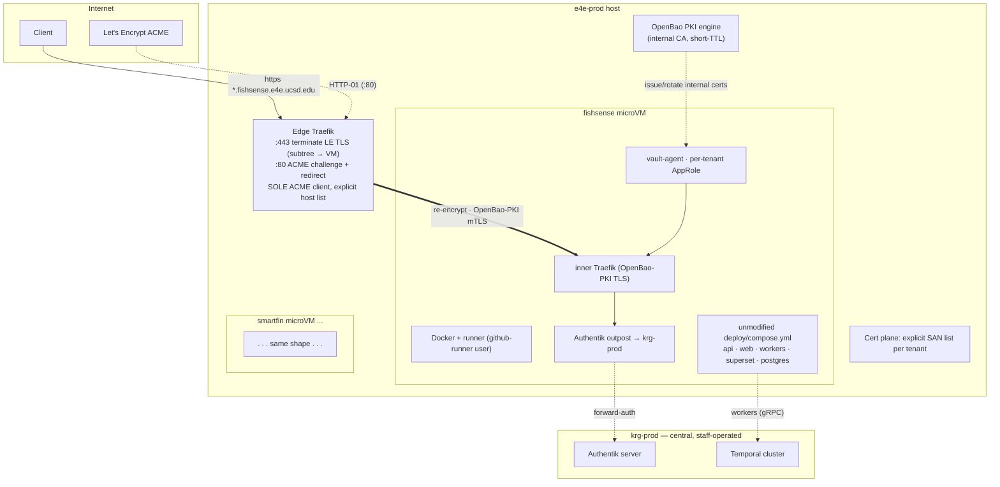

# e4e-prod tenant platform — architecture & onboarding

> Design companion to [ADR 0008](adr/0008-e4e-prod-tenant-platform.md). The ADR
> records *what* was decided and *why*; this doc is the *how* — topology, the
> `krg.tenants` interface, the request path, secrets/PKI, and onboarding. Status:
> **design — not yet built.** The e4e-prod VM is unprovisioned, so everything
> here is offline declarative work until the host boots.

## What e4e-prod is

The home for student-built **E4E** project services. Each project owns its own
repo, its own `deploy/compose.yml`, and its own deploy (a self-hosted runner
doing `docker compose up` on merge). The platform owns only the *substrate*
around each project. fishsense-lite is tenant #1; smartfin and future E4E
projects follow the same pattern.

Contrast with krg-prod: krg-prod is staff-operated lab infrastructure where
*this repo* owns every service definition. e4e-prod inverts ownership — the
tenant repo owns the app; the platform owns isolation, ingress, certs, and
secrets plumbing.

## Topology



Key: a **single** edge Traefik holds the only public LE key and is the only
ACME client. Each tenant is a sealed microVM; the edge re-encrypts to it over
internal OpenBao PKI. Authentik and Temporal are reached cross-host on krg-prod.

## Request path (fishsense example)

1. Client → `https://orchestrator.fishsense.e4e.ucsd.edu` resolves (per-hostname
   CNAME → e4e-prod) to the host edge `:443`.
2. Edge Traefik **terminates** the public LE cert, matches the `*.fishsense`
   subtree → fishsense VM, and **re-encrypts** over OpenBao-PKI (mTLS) to the
   VM's inner Traefik.
3. Inner Traefik terminates the internal cert, applies the tenant's own
   `authentik@docker` outpost (per-route, from compose labels; outpost
   forward-auths to krg-prod Authentik), and routes to the app container.
4. fishsense workers reach krg-prod's Temporal over gRPC; SSO subjects resolve
   against krg-prod Authentik. Object store (Garage) + NAS are reached per the
   tenant's own mounted config, outside the platform's concern.

## The `krg.tenants.<name>` module (interface sketch)

Not yet written — this is the intended surface. Each tenant is one declaration;
the module generates the microVM, user, ZFS volume + caps, runner, vault-agent
targets, OpenBao AppRole reference, and the edge hostname→VM rule.

```nix
krg.tenants.fishsense = {
  repo = "UCSD-E4E/fishsense-lite";        # repo-scoped runner registers here
  subtree = "fishsense.e4e.ucsd.edu";      # wildcard SNI/Host rule → this VM
  hostnames = [                            # EXPLICIT SAN list for LE issuance
    "fishsense.e4e.ucsd.edu"
    "orchestrator.fishsense.e4e.ucsd.edu"
    "workflows.fishsense.e4e.ucsd.edu"
    "analytics.fishsense.e4e.ucsd.edu"
  ];
  deployDir = "/srv/fishsense";            # persistent runner checkout (in-VM)
  resources = { vcpu = 6; memMiB = 16384; diskGiB = 200; };
  isolation = "microvm";                   # pluggable knob (default)
  secrets.openbaoPath = "secret/e4e-prod/fishsense";  # per-tenant AppRole scope
};
```

Routing stays stable: adding `newthing.fishsense.e4e.ucsd.edu` needs **no** edge
routing change (the subtree rule catches it) — only a CNAME ticket and a
one-line `hostnames` addition (the SAN re-issue), plus the tenant's own
compose service.

## Hypervisor & VM substrate

Tenants are **microvm.nix guests nested inside the e4e-prod Proxmox guest**
(decided 2026-06-17). e4e-prod stays a **fabricant VM, sized generously** — the
student-stack IO contention against fabricant's shared pool ([ADR 0004](adr/0004-vm-disk-io-budget.md))
is accepted and monitored, not engineered around with dedicated hardware (revisit
if it bites).

- **Nesting prerequisite:** nested KVM on fabricant — `kvm_intel nested=1` (module
  option) + e4e-prod's PVE CPU type set to `host`. Confirm/enable before build.
- **Backend: cloud-hypervisor** (decided 2026-06-17). Low-overhead Rust VMM,
  fast boot, virtiofs + virtio-blk + TAP — crosvm DNA re-targeted at long-running
  server workloads, with first-class microvm.nix/NixOS gravity for headless
  guests. `krg.tenants` is still written backend-agnostic so it's swappable;
  **QEMU** is the compatibility fallback. **firecracker excluded** (no virtiofs /
  minimal device model). **crosvm weighed and excluded** — its ChromeOS/Android
  desktop-virtualization focus (GPU/wayland) is off-target for headless service
  fleets, and its per-device sandboxing edge is tail-risk here since the VM is
  already the tenant boundary (semi-trusted tenants, not hostile guests).
- **Per-tenant disk:** a dedicated ZFS **zvol** as the VM's durable block device
  (DEPLOY_DIR + Postgres), so tenant data is on its own dataset with its own
  quota — a real boundary, independent of the rolled-up root.
- **Networking:** TAP-on-bridge per VM; inter-VM firewalling on the host
  (nftables on the bridge); the edge reaches each VM by its bridge IP.

## Secrets & PKI

- **Public TLS:** the edge is the sole ACME client; explicit SAN list per tenant;
  HTTP-01; staging-first; ~60-day renewal; **on-demand TLS forbidden** (ADR 0008
  issuance invariant).
- **Internal TLS:** an **OpenBao PKI** secrets engine is the internal CA. Each
  VM's vault-agent fetches + auto-rotates a short-TTL cert for its inner Traefik;
  the edge presents an OpenBao-issued client cert for mTLS to the backend.
- **App secrets:** each tenant has a per-tenant **OpenBao AppRole** + policy
  scoping it to its own path. Its vault-agent renders the app's `.secrets/` /
  env into the VM's `DEPLOY_DIR` (fail-closed) — so the tenant's compose, which
  reads those files, runs unmodified. No host-side plaintext secrets, no
  pre-Vault `.secrets` interim.

## Onboarding a new tenant (checklist)

1. **DNS:** request per-hostname CNAMEs (`<name>.<subtree> → e4e-prod.ucsd.edu`)
   — external ticket, one per hostname.
2. **OpenBao:** create the tenant's KV path, policy, and AppRole; seed app
   secrets (no plaintext in this repo).
3. **Authentik (krg-prod):** register the tenant's app(s)/provider(s) + outpost
   in `terraform/authentik/applications_e4e.tf`; ship app-tile icons (CLAUDE.md
   §4).
4. **Platform:** add `krg.tenants.<name>` (repo, subtree, hostnames, resources,
   AppRole path); `nix flake check`; deploy e4e-prod.
5. **Runner:** register the repo-scoped runner token (operator secret) so the
   in-VM `github-runner` comes online.
6. **Repo side:** the tenant repo sets `DEPLOY_DIR`/`USER_ID`/`GROUP_ID`,
   bootstraps its ops dirs, and points at central Authentik + Temporal.
7. **Deploy:** first `auto-deploy/*` merge runs `docker compose up` in the VM.

## fishsense-lite specifics (tenant #1)

The platform substrate plus the coordinated repo-side changes we own:

- **Drop its own Temporal** (`compose.temporal.yml`) → point workers at krg-prod
  Temporal (needs a `fishsense` namespace + client mTLS + cross-host gRPC on the
  krg-prod side).
- **Fix the stale OIDC issuer** `auth.fabricant.ucsd.edu` → `auth.krg.ucsd.edu`
  (temporal-ui + web `AUTH_AUTHENTIK_*`).
- **Set** `DEPLOY_DIR` (e.g. `/srv/fishsense`), `USER_ID`/`GROUP_ID`; restore
  ops dirs (`pg_volumes/`, `worker_volumes/<svc>/config`, `temporal_volumes/certs`
  — though Temporal certs move to the krg-prod relationship, `.secrets/`).
- Hostnames: `fishsense.`, `orchestrator.fishsense.`, `workflows.fishsense.`,
  `analytics.fishsense.` (+ the `qcomm.docs.fabricant` static server, TBD whether
  it stays).
- Note the upstream `ports: 5432:5432` on Postgres — `krg.docker.defaultPublishAddress`
  doesn't apply inside the VM, but the VM boundary contains it; confirm it isn't
  bound to the VM's external interface.

## Open items

- [x] **CA source** — **Let's Encrypt** (decided). InCommon rejected: per-cert
      manual approval is incompatible with automated renewal (ADR 0008).
- [ ] e4e-prod VM provisioning on fabricant → real `hardware-configuration.nix`,
      static IP `137.110.161.107`, generous CPU/RAM/IO sizing, first deploy.
- [ ] **Nested KVM on fabricant** — `kvm_intel nested=1` + e4e-prod CPU type
      `host` (prerequisite for the nested microvm.nix fleet).
- [ ] microvm.nix as a flake input (cloud-hypervisor backend); per-tenant zvol;
      host bridge networking + inter-VM firewall.
- [ ] OpenBao PKI engine standup (root/intermediate, roles, TTLs) on krg-vault.
- [ ] krg-prod Temporal: `fishsense` namespace, client-cert issuance, cross-host
      gRPC exposure + firewall.
- [ ] Per-VM monitoring (node/cadvisor → prometheus_network) and whether tenant
      VMs AD-join (default: no).
- [ ] `krg.tenants` module implementation + fishsense instantiation.
