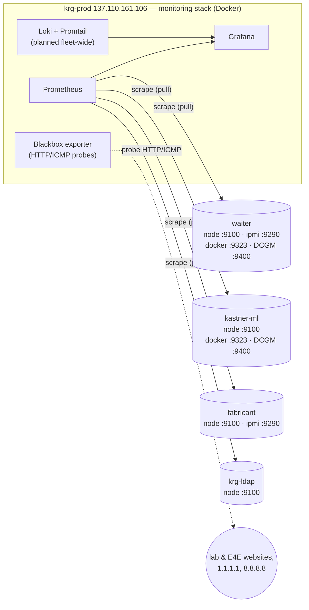

# Fleet inventory & monitoring map

Canonical list of every machine in the KRG infrastructure — IP, role, config
layer, and (for VMs) hypervisor + VMID — plus how monitoring is wired. IPs are
otherwise scattered across [`nix/networks/trusted.json`](../nix/networks/trusted.json)
comments and per-host configs; this is the one table to update when they change.

> **Related:** topology diagrams for [waiter](waiter-topology.md) ·
> [fabricant](fabricant-topology.md) · [krg-ldap](krg-ldap-topology.md).

## Hosts

| Host | IP | FQDN | Role | Config layer | Hypervisor / kind | VMID |
|---|---|---|---|---|---|---|
| **fabricant** | 137.110.161.98 | fabricant.ucsd.edu | Proxmox VE hypervisor; NFS server | Ansible (`proxmox`) | physical | — |
| **waiter** | 137.110.161.67 | waiter.ucsd.edu | GPU/FPGA compute (`compute` profile) | NixOS flake | physical | — |
| **krg-ldap** | 137.110.161.109 | krg-ldap.ucsd.edu | Samba AD DC, `KRG.LOCAL` (`directory`) | NixOS flake | VM on fabricant | 100 |
| **krg-vault** | 137.110.161.123 | krg-vault.ucsd.edu | OpenBao secrets manager (`base`) | NixOS flake | VM on fabricant | 101 |
| **krg-deploy** | 137.110.161.122 | krg-deploy.ucsd.edu | Ansible + OpenTofu control node; GitHub Actions deploy runner (`base`) | NixOS flake | VM on fabricant | 102 |
| **krg-prod** | 137.110.161.106 | krg-prod.ucsd.edu | Lab-wide services (`server` profile) | NixOS flake | VM on fabricant | 103 |
| **e4e-prod** | TBD | e4e-prod.ucsd.edu | E4E services (scaffold, `server`) | NixOS flake | VM (hypervisor TBD) | TBD |
| **kastner-ml** | 132.239.17.123 | kastner-ml.ucsd.edu | E4E GPU compute, RTX A6000 (`compute` profile) | NixOS flake | physical | — |
| **e4e-nas** | 132.239.17.124 | e4e-nas.ucsd.edu | Synology NAS (krg-prod storage) | (separate IaC effort) | appliance | — |
| ~~krg-ad~~ | 137.110.161.107 | krg-ad.ucsd.edu | **OLD AD — being decommissioned** (breached) | — | — | — |

Other fixed addresses:

| Thing | Value | Where |
|---|---|---|
| Default gateway | 137.110.161.1 | every host's `networking.defaultGateway` |
| Monitoring host (Prometheus) | 137.110.161.106 (krg-prod) | `trusted.json` `monitoring_host` |
| AD DNS / KDC | 137.110.161.109 (krg-ldap) | `krg.adClient.serverIp`; pinned in `/etc/hosts` |
| Site DNS fallbacks | 132.239.0.252, 8.8.8.8, 1.1.1.1 | host `networking.nameservers` (after the DC) |
| Ops admin IPs (off-campus) | 97.252.106.89 (chris), 107.132.34.148 (sean) | `trusted.json` `ipsets.ops` |

> e4e-prod is the only unplaced scaffold — it doesn't pin a static IP in the flake
> (no `networking.interfaces.*` address) and has no assigned hypervisor/VMID yet.
> Fill its `TBD`s once it's deployed. (krg-prod, krg-vault, and krg-deploy now pin
> their static IPs in their host `default.nix`.)

## Trusted-network IPSets

Defined once in [`trusted.json`](../nix/networks/trusted.json), consumed by both
layers (nix `krg.firewall`, Ansible `proxmox_firewall` cluster.fw, CrowdSec
whitelists). Summary:

| IPSet | Contents | Used for |
|---|---|---|
| `public` | `0.0.0.0/1` + `128.0.0.0/1` (the whole internet) | compute SSH |
| `sealab` | Sealab wifi `132.239.10.0/24`, e4e-nas, krg-prod, krg-ldap, old krg-ad | DC↔member SMB/RPC; CrowdSec whitelist |
| `ucsd` | `100.0.0.0/8`, `128.54.0.0/16`, `137.110.0.0/16`, + sealab hosts | service SSH, PVE UI, AD client ports |
| `ops` | off-campus admin IPs (chris, sean) | SSH + PVE UI from off-campus |
| `machines` | fleet domain members (waiter, krg-prod, krg-ldap, krg-deploy, krg-vault) | inter-host trust; CrowdSec whitelist; OpenBao `:8200` source |

## Monitoring map

Prometheus runs on **krg-prod** (Docker compose stack) and scrapes exporters
across the fleet. Each host's in-guest firewall opens the exporter ports **only
to the monitoring host** (`krg.firewall.monitoringPorts` ← `monitoringSourceIp`);
on Proxmox hosts the same restriction is in `cluster.fw`.

### Exporters by host

| Exporter | Port | Source | Hosts | Notes |
|---|---|---|---|---|
| node_exporter | 9100 | native systemd (nix) / systemd (ansible) | all | + ZFS pool-health textfile collector ([`zfs.nix`](../nix/modules/zfs.nix)) |
| ipmi_exporter | 9290 | native systemd | waiter, fabricant, krg-prod | compute + hypervisor + servers |
| DCGM exporter | 9400 | Docker (CDI GPU) | waiter, kastner-ml | coupled to the NVIDIA driver ([`nvidia.nix`](../nix/modules/hardware/nvidia.nix)) |
| docker metrics | 9323 | dockerd | waiter, kastner-ml | Docker daemon metrics endpoint |

> **Prometheus scrape config** [`prometheus.yml`](../nix/docker-compose/krg-prod/prometheus/prometheus.yml)
> now targets the renamed hosts (`krg-prod.ucsd.edu`, etc.) per the machine/CNAME
> rename plan. The dead `ansible_deploy_monitor` `:9000` job has been dropped
> (replaced by `system.autoUpgrade`), and `kastner-ml.ucsd.edu` is now a real
> provisioned fleet host (issue #223) scraped for node/dcgm/docker metrics — no
> longer an unmanaged leftover. Blackbox probe targets (E4E/lab websites) track the
> new CNAMEs. **krg-vault** and **krg-deploy** also expose node-exporter `:9100`
> (monitoring-host only) but are not yet in the `node_exporter` scrape job — add them
> when convenient.
