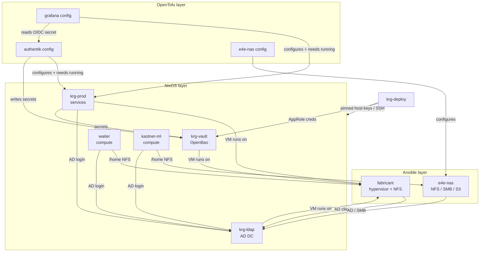

# Lab interdependencies

How the pieces of the KastnerRG/E4E infrastructure depend on each other — at
**deploy time** (what must be applied before what) and at **runtime** (what
breaks, and how gracefully, when a component is down).

This exists because the dependencies are not obvious from any single layer:
`nix/` configures a compute box to mount `/home`, but the *export* it mounts is
created in `ansible/`; OpenTofu configures a service that only exists because
`nix/` deployed it. Getting the order wrong **deadlocks** (see the worked example
at the end). Keep this current when you add a host, a mount, or a service.

> Related: [fleet-inventory.md](fleet-inventory.md) ·
> [waiter-topology.md](waiter-topology.md) ·
> [krg-ldap-topology.md](krg-ldap-topology.md) ·
> [joining-a-host-to-the-domain.md](joining-a-host-to-the-domain.md) ·
> [deploy/README.md](../deploy/README.md) · [adr/0005-repo-integration-opentofu-krg-deploy.md](adr/0005-repo-integration-opentofu-krg-deploy.md)

---

## Components

| Component | Layer | Role |
|---|---|---|
| **fabricant** | ansible (Proxmox/Debian) | Hypervisor — hosts the VMs. Serves NFS `/home` + `/scratch` cold for KRG (`rpool/nfs`). Owns the perimeter firewall. |
| **e4e-nas** | ansible (Synology DSM) | Storage appliance. Serves NFS `/home` for E4E compute (`e4e-home`), SMB shares, Garage S3. |
| **krg-ldap** | nix (VM) | Samba AD domain controller — `KRG.LOCAL` identity for **every** host. |
| **krg-vault** | nix (VM) | OpenBao — secrets for services (vault-agent) and for the deploy itself (AppRole). |
| **krg-prod** | nix (VM) | Lab-wide services: Authentik (SSO), Traefik, Grafana/Prometheus/Loki, Outline, … |
| **e4e-prod** | nix (VM) | E4E project services (not yet provisioned). |
| **waiter** | nix (physical) | KRG GPU compute. |
| **kastner-ml** | nix (physical) | E4E GPU compute. |
| **krg-deploy** | nix (VM) | Control node — runs the CD pipeline (`deploy.yml`) and the nightly pull-apply. |

---

## Dependency graph

---

## Deploy-time order (CD)

`deploy.yml` applies as a **phased pipeline**, not a single linear layer order
([ADR 0011](adr/0011-cross-layer-deploy-ordering.md)) — because the layers depend on
each other in *both* directions (Ansible's NFS export → NixOS `/home`, but krg-ldap's
NixOS AD firewall → the Ansible AD join), so no "Ansible → NixOS → OpenTofu" ordering
satisfies every edge. Fail-fast between phases. The rule within each phase is still
*provision the substrate before its consumers*; the phasing handles the back-edges.

0. **foundation** — NixOS **krg-vault + krg-ldap**: OpenBao and the AD DC (with its
   in-guest AD firewall, which the Ansible phase needs to reach the DC). Hoisted
   ahead of Ansible so the shared prerequisite is up first.
1. **substrate** — **Ansible**: the hypervisor, firewall, and the **NFS exports the
   compute boxes mount as `/home`**. Must precede the member NixOS hosts (a compute
   box can't mount a `/home` export that doesn't exist yet), and now runs after
   phase 0 so fabricant can already reach the DC.
2. **systems** — NixOS **krg-prod + waiter + kastner-ml**: the services (Authentik,
   Grafana, OpenBao consumers) and the compute boxes that mount phase 1's exports.
   Hosts rebuild in the `deploy/lib.sh` `ORDER`
   (`krg-vault → krg-ldap → krg-prod → waiter → kastner-ml`), split across phases 0/2.
3. **config** — **OpenTofu**: configures those services **through their APIs** and
   reads/writes OpenBao secrets, so it must come after they exist. Target order
   (`TOFU_TARGETS`): `authentik → grafana → e4e-nas → temporal` — Grafana reads the
   OIDC secret Authentik mints, so Authentik first.
4. **verify** — `deploy/deploy-verify.sh`: every health/membership gate (OEC daemons,
   `adcli testjoin`) for the whole fleet, **once, here** — after the stages that
   satisfy them. Phases 0–3 converge (gates warn); phase 4 is the only fatal gate, so
   a check can't deadlock the deploy that would make it pass.

`krg-deploy` itself is **excluded** from the NixOS rebuild loop (it runs the job; a
self-switch would restart the runner mid-deploy). It stays current via its nightly
`system.autoUpgrade`. Consequence: a change to `krg-deploy`'s *own* config (e.g. a new
host's SSH key in `programs.ssh.knownHosts`) doesn't take effect until `krg-deploy`
re-switches — so a freshly-added host may be unreachable from CD for one cycle. Force
it with a one-off `nixos-rebuild switch --flake .#krg-deploy` on the box.

---

## Runtime dependencies (and failure modes)

| Consumer | Depends on | Mechanism | If the dependency is down | Mitigation |
|---|---|---|---|---|
| every host | **krg-ldap** (AD) | SSSD / winbind → `KRG.LOCAL` | AD logins fail | SSSD offline cache (`cache_credentials`) + local break-glass admin (off AD). **SPOF** — second DC planned. |
| waiter | **fabricant** NFS | `/home` mount (`krg.nfsHome`) | if down at boot, `/home` unmounted; AD logins **denied** (not given an ephemeral home) | `requireMountForLogin` fail-closed; break-glass admin home is off `/home`. |
| kastner-ml | **e4e-nas** NFS | `/home` mount (`krg.nfsHome` → `e4e-home`) | same as waiter | same; homes are client-uid-owned (`no_root_squash`), so DSM identity is not on the path. |
| all VMs | **fabricant** | Proxmox guests | all guests down | hypervisor hardening + reboot runbook; out of CD scope. |
| krg-prod services | **krg-vault** | vault-agent renders secrets to tmpfs | services fail-closed (no secret) | vault-agent keystone; OpenBao offline cache. |
| Traefik routes | **Authentik** | forward-auth | protected routes 5xx | per-route; public routes unaffected. |
| krg-deploy (CD) | **krg-vault** | AppRole login → KV | tofu/ansible creds unavailable → targets skip | graceful skip with a notice. |
| krg-deploy (CD) | **each host** | SSH, `StrictHostKeyChecking=yes` | host unreachable / new host not in `known_hosts` → deploy fails | pin the key in `krg-deploy`'s `programs.ssh.knownHosts`; `DEPLOY_SSH_ACCEPT_NEW=true` for first bring-up only. |
| Prometheus (krg-prod) | every host | scrapes node/ipmi/dcgm exporters | metrics gaps | soft — no functional impact. |

---

## Bootstrap / circular dependencies

A few edges are genuinely circular and are broken by **local break-glass** access,
never by another networked dependency:

- **fabricant ↔ krg-ldap.** fabricant is an AD client of `krg-ldap`, a VM it *hosts*.
  If fabricant is down, so is the DC. The key-only local `krg-admin` (off AD) is the
  deliberate escape hatch — don't remove it.
- **krg-deploy ↔ krg-vault.** krg-deploy reads its deploy creds from OpenBao, but it
  is also what deploys `krg-vault`. Secret-zero (the AppRole) is provisioned
  out-of-band, not via the pipeline.
- **AD identity ↔ uid alignment.** Linux hosts map AD users algorithmically via SSSD
  (base `751000000` + RID). NFS is uid-based, so any NFS `/home` server must present
  matching uids. fabricant (Linux) aligns natively; **e4e-nas (DSM winbind RID, which
  neither matches SSSD nor resolves AD users) is deliberately bypassed** — the
  `e4e-home` export is `no_root_squash` and the client's `pam_mkhomedir` chowns each
  home to the SSSD uid, so the numeric uid the client writes is what lands on disk.

---

## Worked example: the kastner-ml `/home` deadlock

The dependency that motivated this doc. kastner-ml (`nix/`) mounts `/home` from an
e4e-nas export (`ansible/`):

1. With the **old** stage order (NixOS → Ansible), the deploy applied kastner-ml
   *first*. Its `home.mount` tried to mount an `e4e-home` export that the Ansible
   stage hadn't created yet → `mount.nfs: access denied by server`.
2. `switch-to-configuration` failed → `deploy-nixos.sh` fail-fast stopped the deploy
   → the Ansible stage **never ran** → the export was **never created**.
3. Next deploy: identical failure. A deadlock that no amount of retrying clears.

Fixed by ordering **Ansible → NixOS** so the export exists before the box that mounts
it. The general rule this encodes: **if a NixOS host consumes something an Ansible
target provides (storage, a mount, a hosted VM), Ansible must apply first.**
